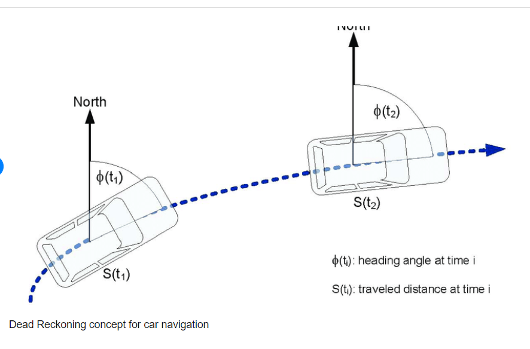
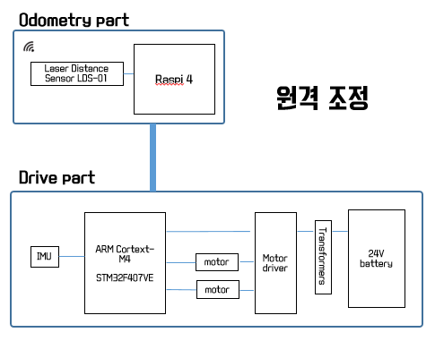
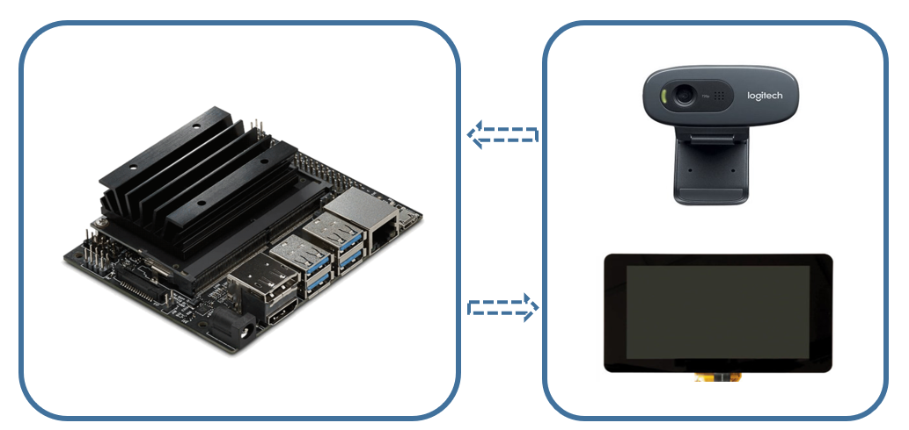

# 부릉부릉 (BrrrrBrrrrr) - Autonomous Mobile Robot

---

 **자율주행 로봇(Autonomous Mobile Robot)**은 공간의 제약으로부터 벗어나 한 대의 로봇만으로 여러 장소에서 업무를 수행할 수 있으므로 다양한 분야에 활용될 수 있습니다. 특히, 실내에서 이동하여 업무를 수행할 수 있는 자율주행 로봇은 물품 조달 로봇부터 간호 로봇, 물류 로봇, 안내 로봇 등으로 광범위하게 활용될 수 있습니다. 우리의 **부릉부릉 자율주행 로봇 시스템**에서는 **빅스비(Bixby) 음성인식**과 여러 가지의 **자율주행 기술**들을 활용하여 특정 장소에 대한 **안내 서비스**를 **비대면**으로 선보이고자 합니다.

 __SLAM(Simultaneous Localization And Mapping)__과 **네비게이션(Navigation)**, **오브젝트 디텍션(Object Detection)** 등을 통해 실제로 특정 실내 환경에서 자율주행이 가능한 ROS 기반의 자율주행 로봇을 다음과 같이 제작하였습니다.

 자율주행로봇은 위와 같이 세 개의 파트로 나눠서 진행되며, 각 파트는 **구동부(Drive part)**, **오도메트리부(Odometry part)**, **커뮤니케이션부(Communication part)**로 나눠집니다. 첫째, **구동부**는 로봇의 움직임을 제어하고 각종 센서 데이터를 수집합니다. 둘쨰, **오도메트리부**는 라이다를 이용해 수집한 정보를 SLAM과 네비게이션 알고리즘에 사용할 수 있도록 가공하고 MCU에 제어명령을 전송합니다. 마지막으로 셋째, **커뮤니케이션부**는 카메라를 이용하여 사용자를 식별하고, 모션 인식 등을 이용해 개인 맞춤형 서비스를 제공합니다. 

## 1. 구동부 (Drive Part)

---

### **구동부 핵심기능**

- 로봇 동작 중 모터의 속도를 제어하기 위한 **PID 컨트롤**
- 센서로부터 받은 관성 정보를 쿼터니언(Quaternion) 값으로 변환하기 위한 **매드윅(Madgwick) 필터**
- 로봇의 움직임을 추측하는 **추측 항법(Dead Reckoning)**
- **rosserial**을 통한 모터 제어 명령 수신 및 센서 데이터 전송

#### **1-1. PID 컨트롤**

 모터 움직임을 안정적으로 제어하기 위하여 **PID 컨트롤**을 사용합니다. 부릉부릉 시스템에서는 Kp = ?, Ki = ?, Kd = ? 를 사용하였습니다.

**[ 참조 ]**

https://en.wikipedia.org/wiki/PID_controller

http://ctms.engin.umich.edu/CTMS/index.php?example=Introduction&section=ControlPID

#### **1-2. 매드윅 필터 (Madjwick Filter)**

 IMU에서 얻어온 관성 데이터 센서값을 **매드윅 필터링**을 수행하여 이동 로봇의 회전 상태를 나타내는 쿼터니언(Quaternion)을 구합니다. 쿼터니언은 로봇의 오도메트리를 구하는데 사용됩니다.

 물체가 회전하도록 중심축을 가진 구조물을 짐벌이라고 하는데, 3차원 공간에서의 강체의 방향은 오일러 각을 이용해 세 번의 회전을 통해 얻을 수 있습니다. 하지만 이 회전 과정에서 두 개 이상의 축이 겹쳐서 다른 축이 자유도를 잃어 원하는 방향으로 회전할 수 없는 현상을 **짐벌락(Gimbal Lock)**이라고 합니다. 이를 매드윅 필터를 이용하면 방지할 수 있습니다.

**[ 참조 ]**

https://www.x-io.co.uk/res/doc/madgwick_internal_report.pdf

https://en.wikipedia.org/wiki/Gimbal_lock

#### **1-3. 추측 항법(Dead Reckoning)**

 본 시스템에서는 바퀴 이동량을 훨 엔코더 값으로 계산하여 **2계 룽게-쿠타 데드레커닝(Sencond Order Runge-Kutta Dead Reckoning)**을 수행하여 자율 주행 이동 로봇의 대략적인 위치를 추정할 수 있습니다.

 여기서 **추측 항법(Dead Reckoning)**이란 이미 알고 있는 출발 위치에서 방향와 속력 등을 계산해 자신의 위치를 추측하며 구동하는 방법을 말합니다. **추측 위치(Dead Reckoning Position, DRP)**는 출발 위치에서 방향와 속력만 계산한 것을 말하며, **추정 위치(Estimated Position, EP)**는 추측 위치에서 신뢰성을 높이기 위해 다양한 외력의 영향을 추가적으로 감안해 구한 위치를 말합니다.

**[ 참조 ]**

[https://en.wikipedia.org/wiki/Runge%E2%80%93Kutta_methods](https://en.wikipedia.org/wiki/Runge–Kutta_methods)

https://en.wikipedia.org/wiki/Rotary_encoder

#### **1-4. rosserial 통신제어**

 **rosserial** 을 통해 모터에 대한 제어 명령을 수신받고 IMU, 휠 엔코더 등 센서 데이터를 가공해 오도메트리 파트로 전달합니다.

## 2. 오도메트리부 (Odometry Part)

---

### **오도메트리부 핵심기능**

- **LiDAR** 정보 수집 및 가공
- 수집한 센서 데이터를 이용한 **원격 조정**
- **SLAM**
- **Navigation**
- ROS랑 백엔드 서버 연결...! :dagger:

#### **2-1. LiDAR 정보 및 수집 가공**

 **라이다(LiDAR, Light Detection and Ranging)**란 광원과 수신기를 사용하여 개체를 탐지하고 거리를 측정하는 센싱 기술입니다. 저희가 측정한 센서 정보는 아래와 같습니다.

 라이다의 작동 원리는, 방출된 적외선 펄스가 물체에 부딪혀 반사되어 돌아오면, 수신기가 돌아온 펄스를 감지하게 됩니다. 여기서 펄스를 전송한 후 수신하기까지의 시간을 측정해 라이다와 물체 사이의 간격을 측정할 수 있는데, 이를 자율 주행 로봇 이동에 사용하거나, Object Detection 등에 이용될 수 있습니다.

**[ 참조 ]**

https://en.wikipedia.org/wiki/Lidar

#### **2-2. 원격 조정**

#### **2-3. SLAM**

 **SLAM(Simultaneous Localization and Mapping, 동시적 위치추정 및 지도작성)**은 하나의 개체가 주변 환경을 인식해 그 공간의 지도를 작성하고, 자신의 위치를 특정하는 알고리즘을 말합니다. 로봇 청소기에서, 청소기가 주변의 사물들을 인식하고, 벽, 천장, 가구 등에 대한 정보를 습득하는 과정을 생각하면 쉽습니다. 이 정보들을 이용해 로봇 청소기는 자동으로 집 안을 청소하고 본래 자기 자신이 있던 곳으로 돌아오게 됩니다.

 본 프로젝트에서는 구글이 2016년 공개한 **카토그래퍼(Cartographer)**라는 SLAM 라이브러리를 ROS 환경에서 사용할 예정이며, 이 과정을 잘 나타낸 동영상이 다음과 같이 나와 있습니다.

<iframe width="941" height="500" src="https://www.youtube.com/embed/DM0dpHLhtX0" frameborder="0" allow="accelerometer; autoplay; encrypted-media; gyroscope; picture-in-picture" allowfullscreen></iframe>

**[ 참조 ]**

https://en.wikipedia.org/wiki/Simultaneous_localization_and_mapping

https://www.youtube.com/watch?v=KKG95xMVTas

#### **2-4. Navigation**

 부릉부릉 자율 주행 Navigation 알고리즘으로 **DWA(Dynamic Window Approach)** 알고리즘을 이용합니다. DWA 알고리즘은 첫째, 검색이 가능한 유효한 공간이 주어져야 하고, 둘째, 이 공간에서 최적의 경로를 찾습니다. 이 검색 경로는 짧은 시간 간격 내에 도달이 가능하며, 충돌이 없는 안전한 원형 궤도로 제한됩니다.

 로봇이 장애물과 최대한의 간격을 두고 도착할 수 있는 방향과 속도를 설정하는 게 제일 중요하다고 말할 수 있습니다. DWA 알고리즘은 ROS 환경에서도 사용이 가능합니다.

**[ 참조 ]**

https://en.wikipedia.org/wiki/Dynamic_window_approach

http://adrianboeing.blogspot.com/2012/05/dynamic-window-algorithm-motion.html

http://citeseerx.ist.psu.edu/viewdoc/download?doi=10.1.1.665.3032&rep=rep1&type=pdf

#### **2-5. 백엔드 서버와 연결**

커밍순

## 3. 커뮤니케이션부 (Communication Part)

### **커뮤니케이션부 핵심기능**

- Object Detection을 통한 객체 인식으로 장애물 인식
- TSM을 활용한 모션 인식으로 로봇 명령 수행
- OpenCV를 활용한 개인별 맞춤형 서비스

#### **3-1. Object Detection**

- 컴퓨터 비전과 이미지 처리와 관련된 컴퓨터 기술로서, 디지털 이미지와 비디오로 특정한 계열의 시맨틱 객체 인스턴스를 감지한다.

#### **3-2. TSM(Temporal Shift Module)**

- TSM은 3D CNN의 우수한 성능을 가지지만 2D CNN의 복잡성으로 구현할 수 있는, 고효율성으로 대기시간이 짧은 비디오 인식 및 객체 감지가 가능한 모델이다.
- 손 제스처를 사용하여 컴퓨터와 통신할 수 있는 시나리오를 구동하는 데 유용하다.

#### **3-3. OpenCV**

- 실시간 컴퓨터 비전을 목적으로 이미지 프로세싱에 중점을 둔 라이브러리이다.
- 사용자 얼굴을 인식하여 본인확인 후 개인 맞춤형 서비스를 제공할 수 있다.