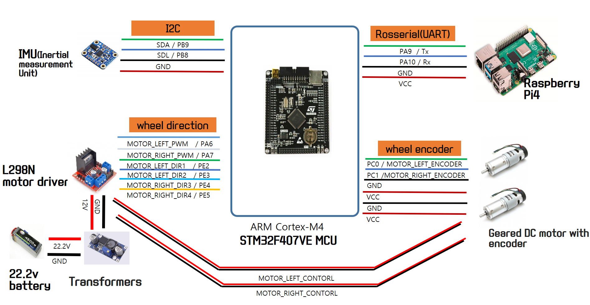

# BrrBrr - Autonomous mobile robot

자율주행 로봇은 공간 제약성에서 벗어나 한 대의 로봇만으로 여러 장소에서 과업을 수행할 수 있으므로 다양한 분야에 활용될 수 있습니다. 특히, 실내에서 이동하여 과업을 수행할 수 있는 자율주행 로봇은 물품 조달 로봇부터 간호 로봇, 물류 로봇, 안내 로봇 등으로 광범위하게 활용될 수 있습니다. 부릉부릉 시스템에서는 음성인식과 자율주행 기술을 활용하여 안내서비스를 선보이고자 합니다.

 SLAM(Simulataneous Localization And Mapping)과 네비게이션(Navigation), 오브젝트 인식 기능을 통해 실제 실내 환경에서 자율주행이가능한 ROS 기반의 이동로봇을 다음과 같이 제작하였습니다.

자율주행로봇은 아래와 같이 세 가지 파트로 나눠서 진행되며, 각 파트는 구동부(Drive part), 오도메트리부,(Odometry part) , 커뮤니케이션부(Communication part)로 나눠집니다. 첫째, 구동파트는 로봇이 움직임을 제어하고 각종 센서데이터를 수집합니다. 둘쨰, 오도메트리부는 라이다 정보를 SLAM과 네이게이션 알고리즘에 사용할 수 있도록 가공하고 MCU에게 제어명령을 전송합니다. 셋째, 커뮤니케이션부는 카메라를 이용하여 사용자를 식별하고 개인별 맞춤형 서비스를 제공합니다. 

## Drive Part

### 구동부 핵심기능

- 모터 속도제어를 위한 PID 컨트롤
- 관성 정보를 쿼터니언값으로 변환하기 위한 Madgwick 필터
- 로봇의 움직임을 추측하는 추측 항법 
- rosserial를 통한 모터제어 명령 수신 및 가공 데이터 전송

#### PID 컨트롤

모터 움직임을 안정적으로 제어하기 위하여 PID 컨트롤을 사용합니다.  부릉부릉 시스템에서는 Kp= ?, Ki=?, Kd=?을 사용하였습니다.

#### Madjwick 필터

IMU에서 얻어온 관성 데이터를 매드윅(Madgwick) 필러링을 수행하여 이동 로봇의 회전 상태를 나타내는 쿼너니언(Quaternion)을 구합니다. 쿼터니언은 로봇의 오도메트리를 구하는데 사용됩니다. 

- Ref) Madjwick filter: https://www.x-io.co.uk/res/doc/madgwick_internal_report.pdf

#### 추측 항법

본 시스템에서는 바퀴 이동량을 훨 엔코더 값으로 받아와  2계 룽게-쿤타 데드레커닝(sencond order Runge-Kutta Dead Reckoning)을 수행하여 이동 로봇의 대략적인 위치를 추정합니다.

#### rosserial 통신제어

rosserial을 통해 모터제어 명령을 수신받고 IMU, 휠 엔코더 등 가공 센서 데이터를 전달합니다. 

## Odometry Part

### 오도메트리부 핵심기능
- LiDAR정보 수집 및 가공 
- 원격 조정
- SLAM
- Navigation
- ROS랑 백엔드 서버 연결...! :dagger:

#### LiDAR 정보 및 수집 가공

라이다를 활용하여 실내 공간 센싱정보 획득하습니다.

#### 원격 조정

커밍순

#### SLAM

커밍순

#### Navigation

커밍순

#### 백엔드 서버와 연결

커밍순

## Communication Part

### 커뮤니케이션부 핵심기능

- Object Detection을 통한 객체 인식으로 장애물 인식
- TSM을 활용한 모션 인식으로 로봇 명령 수행
- OpenCV를 활용한 개인별 맞춤형 서비스

#### Object Detection

- 컴퓨터 비전과 이미지 처리와 관련된 컴퓨터 기술로서, 디지털 이미지와 비디오로 특정한 계열의 시맨틱 객체 인스턴스를 감지한다.

#### TSM(Temporal Shift Module)

- TSM은 3D CNN의 우수한 성능을 가지지만 2D CNN의 복잡성으로 구현할 수 있는, 고효율성으로 대기시간이 짧은 비디오 인식 및 객체 감지가 가능한 모델이다.
- 손 제스처를 사용하여 컴퓨터와 통신할 수 있는 시나리오를 구동하는 데 유용하다.

#### OpenCV

- 실시간 컴퓨터 비전을 목적으로 이미지 프로세싱에 중점을 둔 라이브러리이다.
- 사용자 얼굴을 인식하여 본인확인 후 개인 맞춤형 서비스를 제공할 수 있다.